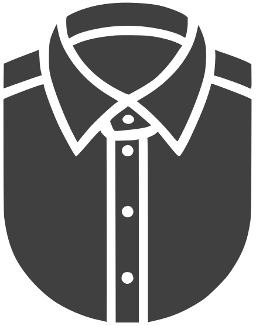

<h1 align="center">Napolifit - 3D Shirt Configurator</h1>

<div style="width:100%; display:flex; padding-bottom:1rem;">
  
</div>

This project is a sophisticated 3D shirt configurator application built with Next.js 14, Three.js, React Three Fiber, NextUI, and Tailwind CSS. It allows users to customize and visualize Neapolitan-style shirts in a dynamic 3D environment.

Key features include:

- Comprehensive shirt customization options including collar styles, cuff types, button styles, placket options, pocket styles, and embroidery details
- Real-time 3D visualization of customizations
- Responsive design for both mobile and desktop devices
- Smooth animations and page transitions using Framer Motion
- Dynamic Plexus effect background for enhanced visual appeal
- Integration with Cloudinary for image management
- State management with React Query for efficient data fetching
- Debug mode for fine-tuning 3D models and shaders

The application combines cutting-edge web technologies to create an immersive and user-friendly shirt design experience, showcasing the power of 3D visualization in e-commerce and fashion customization.

## Deployed Version

For live demo please visit 👉 https://3d-shirt-configurator.vercel.app/

## Table of Contents

- [Technologies Used](#technologies-used)
- [Getting Started](#getting-started)
  - [Installation](#installation)
  - [Usage](#usage)
- [Debugging and Configuration](#debugging-and-configuration)
- [Contributing](#contributing)
- [License](#license)
- [Social](#social)

## Technologies Used

- [Next.js 14](https://nextjs.org/docs/getting-started)
- [Three.js](https://threejs.org/)
- [React Three Fiber](https://docs.pmnd.rs/react-three-fiber/getting-started/introduction)
- [NextUI v2](https://nextui.org/)
- [Tailwind CSS](https://tailwindcss.com/)
- [TypeScript](https://www.typescriptlang.org/)
- [Framer Motion](https://www.framer.com/motion/)
- [Cloudinary](https://cloudinary.com/)

## Key Directories

```bash
├── app/                 # Next.js pages and layout configuration
├── assets/              # Static assets
├── components/          # Reusable React components
│   ├── common/          # Reusable components for the application
│   ├── configurator/    # Components for shirt customization
│   ├── layout/          # Layout components for structuring UI
│   ├── webgl/           # Three.js setup and 3D rendering components
├── config/              # Configurations like fonts, site data
├── constants/           # Application-wide constants
├── hooks/               # Custom React hooks
├── providers/           # Context providers
├── server/              # Server-side actions
├── styles/              # Global CSS and style definitions
├── theme/               # Theme-related utilities and configs
├── types/               # TypeScript types
├── utils/               # Utility functions and helpers
```

## Getting Started

### Installation

### Clone the repository and install dependencies:

```bash
git clone https://github.com/hkzone/3d-shirt-configurator.git
cd 3d-shirt-configurator
npm install
```

### Run the development server

```bash
npm run dev
```

## Usage

Once the application is running, you can:

1. Navigate to the **Configurator** page to start customizing your shirt.
2. Select different options for fabric, styles, and embroidery.
3. View the changes in real-time in the 3D model.

## Debugging and Configuration

To access the debug panel and fine-tune the 3D model and shaders, simply add `?debug` to the end of the URL. This will enable various parameters that allow you to adjust the scene, including:

- 3d model position
- Environment position
- Camera position
- Background Shader settings
- Fabric material settings

## Contributing

If you'd like to contribute, please fork the repository, create a feature branch, and submit a pull request with your changes.

## License

This work is licensed under a Creative Commons Attribution-NonCommercial 4.0 International License. For more information, see `LICENSE` or visit [Creative Commons License](https://creativecommons.org/licenses/by-nc/4.0/)

## Social

Made By [Vitaliy Vlasyuk @_hkzone_](https://twitter.com/_hkzone_)

[Twitter](https://twitter.com/_hkzone_) - [Portfolio](https://vitaliyvlasyuk.com/) - [Github](https://github.com/hkzone)
